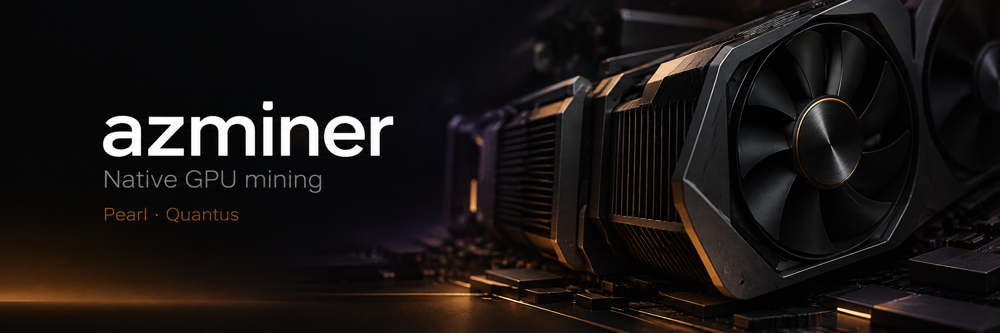

<div align="center">



[](https://github.com/azminer-app/azminer/releases/latest) [](#download) [](#supported-coins)

[Download](#download) · [Quick start](#quick-start) · [GPU support](#gpu-support) · [Performance](#performance) · [Options](#options) · [API](#monitoring-api)

</div>

azminer is a self-contained executable with pool failover, per-GPU tuning, temperature protection, a stall watchdog and a monitoring API. An NVIDIA driver is required.

## Download

Packages below are for **v1.2.1**. See [Releases](https://github.com/azminer-app/azminer/releases/latest) for the current version.

| Platform | Download | Requirements |
| --- | --- | --- |
| **Windows x86_64** | [ZIP package](https://github.com/azminer-app/azminer/releases/download/v1.2.1/azminer-v1.2.1-windows-x86_64.zip) | Windows 10/11 and an NVIDIA driver |
| **Linux x86_64** | [Standalone binary](https://github.com/azminer-app/azminer/releases/download/v1.2.1/azminer-v1.2.1-linux-x86_64) | GLIBC ≥ 2.28 and an NVIDIA driver |
| **Rig integration** | [Integration bundle](https://github.com/azminer-app/azminer/releases/download/v1.2.1/azminer-v1.2.1.tar.gz) | Binary, integration scripts and setup instructions |

[SHA256SUMS](https://github.com/azminer-app/azminer/releases/download/v1.2.1/SHA256SUMS) is available for download verification.

<details>
<summary><strong>Verify a download</strong></summary>

Download `SHA256SUMS` from the same release as your package. Keep the package's original filename.

**Linux**

```bash
sha256sum --ignore-missing -c SHA256SUMS
```

**Windows PowerShell**

```powershell
Get-FileHash .\azminer-v1.2.1-windows-x86_64.zip -Algorithm SHA256
```

Compare the returned hash with the entry for that filename in `SHA256SUMS`.

</details>

## Quick start

Replace `POOL_HOST:PORT` with your pool's endpoint and the wallet placeholder with your payout address for the selected coin. The examples use `.rig1` as the worker name; follow your pool's login format.

### Windows

1. Extract the ZIP package.
2. Open `start-pearl.bat` or `start-quantus.bat` in a text editor.
3. Set `WALLET`, save the file and double-click the launcher.

For example, in `start-pearl.bat`:

```bat
set "WALLET=YOUR_PEARL_WALLET"
```

### Linux

Download the binary and make it executable:

```bash
curl -fL -o azminer \
  https://github.com/azminer-app/azminer/releases/download/v1.2.1/azminer-v1.2.1-linux-x86_64
chmod +x azminer
```

Then run **one** of the following commands.

**Pearl**

```bash
./azminer -a pearl \
  -o stratum+tcp://POOL_HOST:PORT \
  -u YOUR_PEARL_WALLET.rig1
```

**Quantus**

```bash
./azminer -a quantus \
  -o stratum+tcp://POOL_HOST:PORT \
  -u YOUR_QUANTUS_WALLET.rig1
```

The same mining arguments work on Windows with `azminer.exe`. If the pool URL has no scheme, azminer defaults to `stratum+tcp://`.

## Supported coins

| Coin | Algorithm | Selection | Dev fee |
| --- | --- | --- | ---: |
| **Pearl (PRL)** | `pearlhash` | `-a pearl` | 2% |
| **Quantus** | `qpow-poseidon2` | `-a quantus` | 2% |

The fee is collected through short, periodic mining intervals using the developer wallet. **Published hashrates already account for the miner fee.** Pool fees are separate.

## GPU support

azminer is **NVIDIA-only**. The current build targets SM **7.5, 8.6, 8.9 and 12.0**.

| Architecture | GPU family | Status |
| --- | --- | --- |
| Blackwell | RTX 50xx | Supported |
| Ada Lovelace | RTX 40xx | Supported |
| Ampere | RTX 30xx | Supported |
| Turing | RTX 20xx / GTX 16xx | Supported |
| Pascal | GTX 10xx | Planned; unavailable in v1.2.1 |

Run `azminer -list` to check detected CUDA devices and route support.

## Performance

Measurements come from the project's hardware regression sweep with approximately stock clocks. Results vary with driver, cooling and tuning. **Compare hashrates within the same coin.**

| GPU | Generation | Pearl | Quantus | Reported power |
| --- | --- | ---: | ---: | ---: |
| RTX 4070 Ti | Ada | 162.6 TH/s | 693.6 MH/s | ~284 W |
| RTX 4070 SUPER | Ada | 143.2 TH/s | 613.7 MH/s | ~218 W |
| RTX 5060 Ti | Blackwell | 99.5 TH/s | 412.4 MH/s | ~165 W |
| RTX 5070 Ti | Blackwell | 96.5 TH/s | 382.0 MH/s | ~94 W |
| RTX 4060 Ti | Ada | 89.6 TH/s | 387.2 MH/s | ~165 W |
| RTX 3070 | Ampere | 80.0 TH/s | 355.2 MH/s | ~219 W |
| RTX 3080 | Ampere | 75.3 TH/s | 407.9 MH/s | ~190 W |
| RTX 3060 Ti | Ampere | 65.3 TH/s | 296.1 MH/s | ~180 W |
| RTX 4060 | Ada | 61.8 TH/s | 283.0 MH/s | ~114 W |
| RTX 2070 SUPER | Turing | 61.5 TH/s | 285.1 MH/s | ~206 W |
| RTX 2060 | Turing | 49.5 TH/s | 231.8 MH/s | ~188 W |
| RTX 3060 | Ampere | 43.5 TH/s | 201.1 MH/s | ~110 W |
| RTX 3060 Laptop | Ampere | 34.0 TH/s | 177.4 MH/s | ~60 W |
| RTX 5060 Laptop | Blackwell | 27.8 TH/s | 143.9 MH/s | ~27 W |
| GTX 1660 Ti | Turing | 1.18 TH/s | 175.0 MH/s | ~57 W |
| GTX 1660 SUPER | Turing | 1.08 TH/s | 162.8 MH/s | ~59 W |

Hashrates include the 2% miner dev fee. Each row has one reported power figure; separate power measurements for each coin are not provided.

## Options

Run `azminer --help` for the complete reference. Long options accept both `-long` and `--long`.

| Option | Purpose |
| --- | --- |
| `-a`, `-algo` | Select `pearl` or `quantus` |
| `-o`, `-pool` | Set the primary pool endpoint |
| `-u`, `-wal` | Set the pool login / wallet |
| `-worker` | Append a worker name |
| `-p`, `-pass` | Set the pool password; default `x` |
| `-g`, `-gpus` | Select GPUs, e.g. `0,1`; default `all` |
| `-config` | Load a JSON configuration file; CLI flags override file settings |

### Pool failover

Configure a secondary pool and its credentials:

```bash
./azminer -a pearl \
  -o PRIMARY_POOL_HOST:PORT -u YOUR_PEARL_WALLET.rig1 -p x \
  -pool2 BACKUP_POOL_HOST:PORT -wal2 YOUR_PEARL_WALLET.rig1 -pass2 x
```

Replace both endpoints with actual pool addresses.

<details>
<summary><strong>Advanced controls and diagnostics</strong></summary>

Check `--help` for accepted units, per-GPU syntax and values.

| Control | Options |
| --- | --- |
| Core / memory offsets | `-cclock`, `-mclock` |
| Power limit | `-powlim` |
| Fan control / temperature target | `-tt` |
| Fan bounds / temperature cap | `-fanmin`, `-fanmax`, `-tmax` |
| Thermal pause / resume | `-tstop`, `-tstart` — thresholds in °C |
| GPU duty-cycle cap | `-gpow` — 1 to 100 |
| Reconnect / failover policy | `-fret`, `-ftimeout`, `-retrydelay` |
| Watchdog / restart policy | `-wdog`, `-wdtimeout`, `-rmode` |
| Timed operation / pause windows | `-timeout`, `-pauseat`, `-resumeat` |
| File logging / size bounds | `-log`, `-logfile`, `-logdir`, `-logsmaxsize` |
| List devices | `-list` |
| List compiled algorithms | `--list-coins` |
| Authenticate compiled kernels and exit | `--integrity-selftest` |
| Print version | `-V`, `--version` |

GPU tuning uses NVML. Terminal logs use color when appropriate and switch to plain output when piped.

</details>

## Monitoring API

The standalone API defaults to **`127.0.0.1:3333`**. Use `-cdmport` to set a port or address; accepted forms are `0`, `port` and `IP:port`.

```bash
# getstat1 statistics
curl -s http://127.0.0.1:3333/getstat

# Readable JSON statistics
curl -s http://127.0.0.1:3333/stats.json
```

The API also answers `miner_getstat1` and `miner_getstat2` for compatible monitoring integrations.

## Rig integration

Extract the [integration bundle](https://github.com/azminer-app/azminer/releases/download/v1.2.1/azminer-v1.2.1.tar.gz) and follow its package README.

Set the miner name to `azminer`, choose `pearl` or `quantus`, and provide your pool endpoint and login. Optional extra arguments include `-g 0` or `-g all`.

The `h-stats.sh` script reports hashrate, temperature, fan, shares and bus numbers. Its API port is set by `CUSTOM_API_PORT` in `h-manifest.conf`, with a default of **4068**.


## Troubleshooting

| Issue | Check |
| --- | --- |
| Linux permission error | Make the binary executable with `chmod +x` |
| Missing GLIBC version | Use GLIBC 2.28 or newer |
| Missing GPU | Run `-list`; check the driver and supported architecture |
| Pool connection / authorization error | Check the endpoint, transport, coin, wallet, worker format and password |
| API / rig statistics unavailable | Check the API address; standalone uses port 3333, the integration bundle uses 4068 |
| Unexpected hashrate | Check the selected coin, GPU, driver, clocks, power limit and temperature |

## Support

[Open an issue](https://github.com/azminer-app/azminer/issues) for bug reports or feature requests. Include the azminer version, operating system, driver version, GPU model, selected coin and relevant logs.

## License

azminer is proprietary software; all rights reserved. Third-party components retain their own licenses. See the license notice included with each release package.
